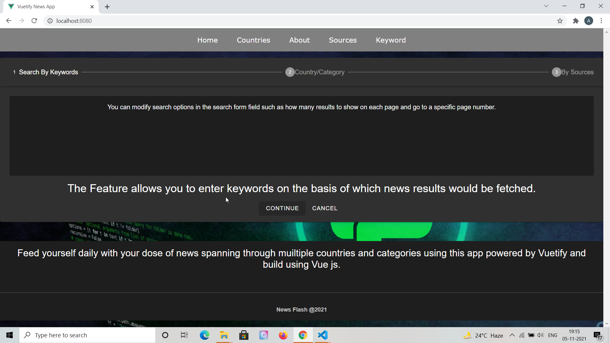
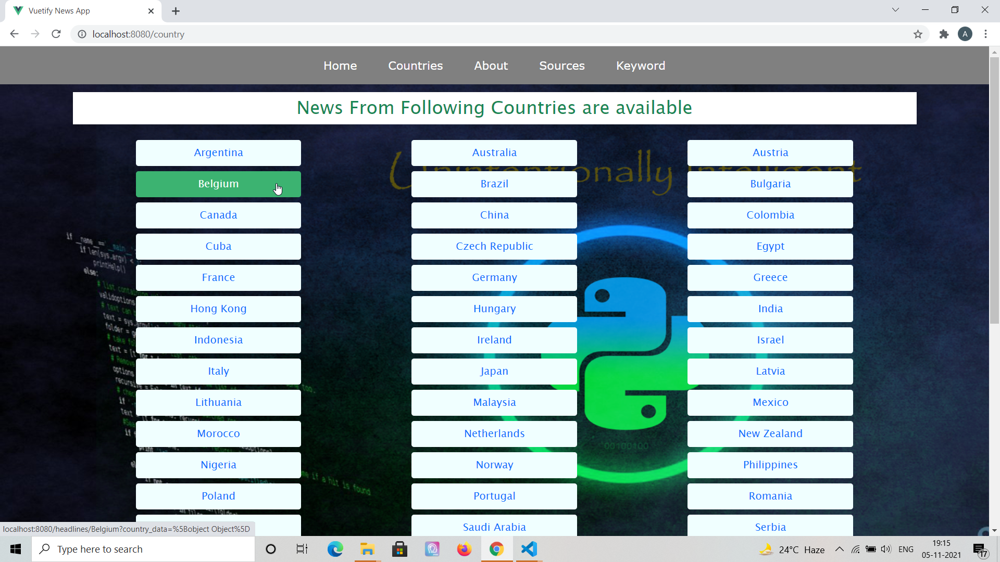
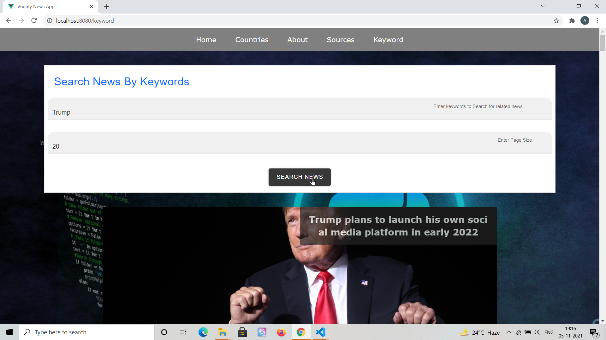
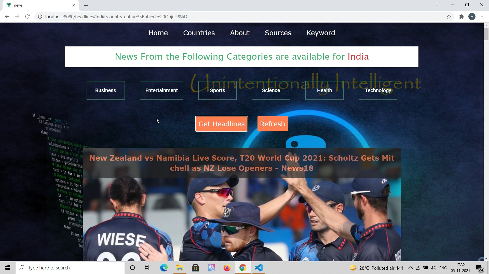

# News App in Vue using NewsAPI - Vue JS and Vuetify ⚡️

## Project Briefing

This uses open API provided by News API website (https://newsapi.org). This project was initialized almost 2 years ago. I revisited this recently and updated the code for it through some code cleaning using Vuetify components whenever possible. This is a comprehensive source of news which is constantly updated and has 100+ news sources from around the world including CNN, BBC, Russia Today and many more. News from around 50+ countries is available across various categories. News can also be fetched via keywords which are not related to any specific category.

Made with ❤️ by **[@apfirebolt](https://github.com/Apfirebolt/)**
## Features

- Makes use of News API (https://newsapi.org), api does require OAuth and has limits on free usage.
- Vuetify components are used for cards, buttons and other UI things for this application. 
- News can be filtered using keywords.
- News can be filtered based on country and category type. For example, you can filter 'Entertainment' category news from 'India' only. 

## Built With

* [Vue 2](https://vuejs.org//)
* [Vuetify](https://vuetifyjs.com/en//)
* [Vuex](https://vuex.vuejs.org//)
* [Bootstrap](https://getbootstrap.com//)

## Project setup

Simply install node modules for the app and run the serve script.

```
npm install
npm run serve
```

For production, run the build npm command and serve the static files through a production or development server.

```
npm run build
npm start
```

## Project Screenshots

Please find some of the screenshots of the application. Below is the screenshot of the Home Page.



Screenshot of the about page.


Screenshot of the Countries Page where you can see list of countries for which you can have the news.



Screenshot of the Keywords News Page where you can get the news related to specific keywords from the API



Screenshot of the News Page, you can get category wise news for a given country.


## To Do

- Applying pagination to news and search news by keyword page.
- Remove bootstrap and use Vuetify components entirely.
- Docker deployment script with nginx. 
